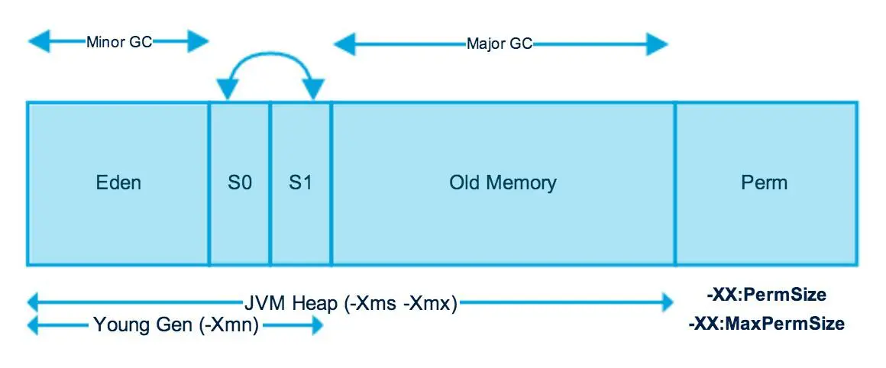

# 1. JAVA

- [1. JAVA](#1.-JAVA)
    - [JVM](#JVM)
        - [JVM 실행과정](#JVM-실행과정)
        - [Class Loader(클래스 로더)](#class-loader클래스-로더)
        - [Execution Engine(실행 엔진)](#execution-engine실행-엔진)
        - [Garbage collector(가비지 컬렉터)](#garbage-collector가비지-컬렉터)
        - [Runtime Data Arar](#runtime-data-area)
            - [Heap 영역의 구조](#heap-영역의-구조)
    - [Annotation](#Annotation)
    - [Collection](#Collection)
        - [배열과의 차이점](#배열과의-차이점)
        - [컬렉션 프에임 워크 계층구조](#컬렉션-프에임-워크-계층구조)
            - [Collection 계층구조](#Collection-계층구조)
            - [Map 계층구조](#Map-계층구조)
        - [특징](#특징)
            - [List](#List-종류-특징)
            - [Set](#Set-종류-특징)
            - [Queue](#Queue-종류-특징)
            - [Map](#Map-종류-특징)
        - [동기화, 병렬 컬렉션](#동기화,-병렬-컬렉션)
            - [동기화된(synchronized) 컬렉션](#동기화된synchronized-컬렉션)
            - [병렬(concurrent) 컬렉션](#병렬concurrent-컬렉션)
    - [Stream](#Stream)
- [참고](#참고)
    - [JVM 참고](#JVM-참고)
    - [Collection 참고](#Collectio-참고)
 

## JVM
> 자바 바이트코드가 JRE 위에서 동작  
> JRE에서 가장 중요한 요소는 자바 바이트코드를 해석하고 실행하는 JVM   
> JRE는 자바 API와 JVM으로 구성되며, JVM의 역할은 자바 애플리케이션을 클래스 로더(Class Loader)를 통해 읽어 들여서 자바 API와 함께 실행하는 것  
> 자바 가상 머신(Java Virtual Machine)은 자바 바이트코드를 해석하고 실행함.  

 

  

### JVM 실행과정
1. JVM은 OS로부터 메모리를 할당 받는다.  
2. JVM 메모리를 여러 영역으로 나누어 관리한다.  
3. 자바 컴파일러(javac)가 자바 소스코드(.java)를 바이트코드(.class)로 변환한다.  
4. Class Loader를 통해 바이트코드(.class)는 런타임 데이터 영역(Runtime Data Areas)에 로드한다.  
5. 실행 엔진(Execution Engine)이 자바 바이트코드를 실행한다.  

### Class Loader(클래스 로더)
> JVM내로 바이트코드(.class)를 로드하는데 자바는 동적 로드, 즉 컴파일타임이 아니라 런타임에 클래스를 처음으로 참조할 때 해당 클래스를 로드하고 링크하는 특징이 있다. 이 동적 로드를 담당하는 부분이 JVM의 클래스 로더이다. 

구분 | 내용  
---|---
부트스트랩 클래스 로더 | JVM을 기동할 때 생성되며, Object 클래스들을 비롯하여 자바 API들을 로드한다. 다른 클래스 로더와 달리 자바가 아니라 네이티브 코드로 구현되어 있다.
확장 클래스 로더 | 기본 자바 API를 제외한 확장 클래스들을 로드한다. 다양한 보안 확장 기능 등을 여기에서 로드하게 된다.
시스템 클래스 로더 | 부트스트랩 클래스 로더와 익스텐션 클래스 로더가 JVM 자체의 구성 요소들을 로드하는 것이라 한다면, 시스템 클래스 로더는 애플리케이션의 클래스들을 로드한다고 할 수 있다. 사용자가 지정한 $CLASSPATH 내의 클래스들을 로드한다.
사용자 정의 클래스 로더 | 애플리케이션 사용자가 직접 코드 상에서 생성해서 사용하는 클래스 로더이다.

### Execution Engine(실행 엔진)
> 클래스 로더를 통해 JVM 내의 런타임 데이터 영역에 배치된 바이트코드는 실행 엔진에 의해 실행된다. 실행 엔진은 자바 바이트코드를 명령어 단위로 읽어서 실행한다.  
> 자바 바이트코드는 기계가 바로 수행할 수 있는 언어보다는 비교적 인간이 보기 편한 형태로 기술된 것이다. 그래서 실행 엔진은 이와 같은 바이트코드를 실제로 JVM 내부에서 기계가 실행할 수 있는 형태로 변경하며, 그 방식은 두 가지가 있다.

구분 | 내용
--- | ---
인터프리터 | 이트코드 명령어를 하나씩 읽어서 해석하고 실행한다. 하나씩 해석하고 실행하기 때문에 바이트코드 하나하나의 해석은 빠른 대신 인터프리팅 결과의 실행은 느리다는 단점을 가지고 있다. 흔히 얘기하는 인터프리터 언어의 단점을 그대로 가지는 것이다. 즉, 바이트코드라는 '언어'는 기본적으로 인터프리터 방식으로 동작한다.
JIT(Just-In-Time) | 인터프리터의 단점을 보완하기 위해 도입된 것이 JIT 컴파일러이다. 인터프리터 방식으로 실행하다가 적절한 시점에 바이트코드 전체를 컴파일하여 네이티브 코드로 변경하고, 이후에는 해당 메서드를 더 이상 인터프리팅하지 않고 네이티브 코드로 직접 실행하는 방식이다. 네이티브 코드를 실행하는 것이 하나씩 인터프리팅하는 것보다 빠르고, 네이티브 코드는 캐시에 보관하기 때문에 한 번 컴파일된 코드는 계속 빠르게 수행되게 된다.

* 자바는 javac로 컴파일 하고 java로 실행시 중간언어(클래스파일)을 한줄 씩 자바인터프로터가 번역하므로 컴파일 언어 이면서 인터프리터 언어이다.  

### Garbage collector(가비지 컬렉터)
> GC를 수행하는 모듈  
  
### Runtime Data Area
> 런타임 데이터 영역은 JVM이라는 프로그램이 운영체제 위에서 실행되면서 할당받는 메모리 영역이다.  
> 런타임 데이터 영역은 6개의 영역으로 나눌 수 있다.  
> 이중 PC 레지스터(PC Register), JVM 스택(JVM Stack), 네이티브 메서드 스택(Native Method Stack)은 스레드마다 하나씩 생성된다.  
> 힙(Heap), 메서드 영역(Method Area), 런타임 상수 풀(Runtime Constant Pool)은 모든 스레드가 공유해서 사용한다.  

  

구분 | 내용
---|---
PC Register | PC(Program Counter) 레지스터는 각 스레드마다 하나씩 존재하며 스레드가 시작될 때 생성된다.  PC레지스터는 현재 수행중인 JVM 명령의 주소를 갖는다.
JVM Stack | JVM 스택은 각 스레드마다 하나씩 존재하며 스레드가 시작될 때 생성된다.  스택 프레임(Stack Frame)이라는 구조체를 저장하는 스택으로, JVM은 오직 JVM 스택에 스택 프레임을 추가하고(push) 제거하는(pop) 동작만 수행한다.   예외 발생 시 printStackTrace() 등의 메서드로 보여주는 Stack Trace의 각 라인은 하나의 스택 프레임을 표현한다.
Native Method Stack | 자바 외의 언어로 작성된 네이티브 코드를 위한 스택이다. 즉, JNI(Java Native Interface)를 통해 호출하는 C/C++ 등의 코드를 수행하기 위한 스택으로, 언어에 맞게 C 스택이나 C++ 스택이 생성된다.
Heap | 인스턴스 또는 객체를 저장하는 공간으로 가비지 컬렉션 대상이다.   new 연산자나 생성된 배열을 저장한다.  JVM 성능 등의 이슈에서 가장 많이 언급되는 공간이다.
Method Area | 메서드 영역은 모든 스레드가 공유하는 영역으로 JVM이 시작될 때 생성된다.  JVM이 읽어 들인 각각의 클래스와 인터페이스에 대한 런타임 상수 풀, 필드와 메서드 정보, Static 변수, 메서드의 바이트코드 등을 보관한다.
Runtime Constant Pool | 메서드 영역에 포함되는 영역이다.  각 클래스와 인터페이스의 상수뿐만 아니라, 메서드와 필드에 대한 모든 레퍼런스까지 담고 있는 테이블이다. 즉, 어떤 메서드나 필드를 참조할 때 JVM은 런타임 상수 풀을 통해 해당 메서드나 필드의 실제 메모리상 주소를 찾아서 참조하며 중복을 막는 역할을 수행한다. 

* JVM은 자바 프로그램에서 메소드가 호출되면, 메소드의 호출과 관계되는 지역 변수와 매개변수를 스택 영역에 저장합니다.이렇게 스택 영역은 메소드의 호출과 함께 할당되며, 메소드의 호출이 완료되면 소멸합니다. 이렇게 스택 영역에 저장되는 메소드의 호출 정보를 스택 프레임(stack frame)이라고 합니다.

#### Heap 영역의 구조
  

#### Permanent Generation
> 클래스와 메소드의 메타데이터 저장.  
> 상수 풀 정보.  
> JVM, JIT 관련 데이터.  
> -XX:PermSize(min), -XX:MaxPermSize(max)로 사이즈 조정.  

* 이 영역은 Java 8 부터는 Native 영역으로 이동하여 Metaspace 영역으로 변경되었다.

#### New/Young 영역
> Eden : 객체들이 최초로 생성되는 공간  
> Survivor 0 / 1 : Eden 에서 참조되는 객체들이 저장되는 공간

#### Old 영역
> Eden 영역에서 객체가 가득차게 되면 첫번째 GC(minor GC)가 발생한다.  
> GC(minor GC) 후 살아남은 객체는 Survivor 0 / 1 영역으로 이동되며 해당 과정을 반복하다가 계속해서 살아남아 있는 개체는 Old영역으로 이동시키게 된다. 

* Minor GC : 새로 생성된 객체는 Eden영역에 위치하고 참조되지 않는 객체는 소멸시키고, Suvivor영역으로 이동 시켰다가 일정시간 이후에 살아남은 객체는 Old영역으로 이동시킨다.

* Major GC : Old영역에 있는 모든 객체들을 검사하여 참조되지 않는 객체들을 삭제한다.

 

 

## Annotation

 

 

## Collection
> 자바에서 컬렉션 프레임워크(collection framework)란 다수의 데이터를 쉽고 효과적으로 처리할 수 있는 표준화된 방법을 제공하는 클래스의 집합  
> 데이터를 저장하는 자료 구조와 데이터를 처리하는 알고리즘을 구조화하여 클래스로 구현해 놓은 것

 

### 배열과의 차이점
> 컬렉션과 배열은 둘 다 개체에 대한 참조를 보유하고 그룹으로 관리 할 수 ​​있다는 점에서 유사  
> 그러나 어레이와 달리 컬렉션은 인스턴스화 할 때 특정 용량을 할당 할 필요가 없음  
> 컬렉션은 개체를 추가하거나 제거 할 때 자동으로 크기를 늘리거나 줄일 수 있음  
> 컬렉션은 int, long 또는 double과 같은 기본 데이터 유형 요소 (기본 유형)를 지정 할 수 없으나 Integer, Long 또는 Double과 같은 래퍼 클래스로 지정 가능  

 

### 컬렉션 프레임 워크 계층 구조  

#### Collection

#### Map

 

### 특징  
인터페이스 | 구현클레스 | 특징  
:---:|:---:|:---  
Set|HashSet TreeSet|순서를 유지하지 않는 데이터의 집합으로 데이터의 중복을 허용하지 않음
List|LinkedList Vector ArrayList|순서가 있는 데이터의 집합으로 데이터의 중복을 허용  
Queue|LinkedList PriorityQueue|FIFO (First In First Out) 방식으로 요소를 정렬 PriorityQueue 클래스는 큐 사용 기능을 제공합니다. 그러나 FIFO 방식으로 요소를 정렬하지 않음
Map|HashTable HashMap TreeMap|키(key), 값(value)의 쌍으로 이루어진 데이터 집합. 순서는 유지되지 않으나 key의 중복을 허용하지 않으나 value의 중복은 허용  
* LinkedHashMap, LinkedHashSet의 경우 순서를 보장합니다.
* Stack의 경우 Vector(항상 동기화)를 상속받기 때문에 잘 사용안함.

 

#### List 종류 특징
- Vector : ArrayList와 유사하나 항상 동기화함. 싱글 스레드일 경우에도 동기화 함.
- ArrayList : index와 value를 같는 선형리스트. Random Access시 index값이 있기에 LinkedList보다 유리함.
- LinkedList :  각 노드가 데이터와 포인터를 가지고 한 줄로 연결되어 있는 방식의 자료구조, 추가 / 삭제시 포인터만 변경하면 되기에 ArrayList보다 유리함.

 

#### Set 종류 특징
- HashSet : HashSet은 순서의 정렬을 가지지 않고, 컬렉션의 객체 저장을 목적으로하는 일반적인 Set
- TreeSet : '레드-블랙 트리(Red-Black Tree)로 구현되어 있음. 데이터의 추가, 삭제에는 시간이 걸리지만, 검색과 정렬이 뛰어나다는 장점
LinkedHashSet : 들어오는 데이터의 순서를 보장하는 Set

 

#### Queue 종류 특징
- PriorityQueue : 먼저 들어온 순서대로 데이터가 나가는 것이 아닌 우선순위를 먼저 결정하고 그 우선순위가 높은 엘리먼트가 먼저 나가는 자료구조  
- LinkedList : FIFO(First-In-First-Out) 구조의 자료구조  

 

#### Map 종류 특징
- HashMap : Map의 특징인 key와 value의 쌍으로 이루어지며, key 또는 value 값으로써 null을 허용   
- HashTable : HashMap과 유사하나 항상 동기화함. key 또는 value값으로 null을 허용하지 않음.  
- LinkedHashMap : 들어오는 데이터의 순서를 보장하는 Map  
- TreeMap : '레드-블랙 트리(Red-Black Tree)로 구현되어 있음. 데이터의 추가, 삭제에는 시간이 걸리지만, 검색과 정렬이 뛰어나다는 장점. Key(null을 허용하지 않음)값을 기준으로 정렬 됨.  

 

### 동기화, 병렬 컬렉션

 

#### 동기화된(synchronized) 컬렉션
> List : Vector  
> Map : Hashtable  
> Collections.synchronizedXXX()로 생성된 컬렉션들  
>  
> 문제점: Thread Safe하나, 두개 이상의 연산을 묶어서 처리해야 할 때 외부에서 동기화 처리를 해줘야 한다. (Iteration, put-if-absent, replace, condition-remove 등)  
> Since JDK 1.2  

 

#### 병렬(concurrent) 컬렉션
> List: CopyOnWriteArrayList  
> Map: ConcurrentMap, ConcurrentHashMap  
> Set: CopyOnWriteArraySet  
> SortedMap: ConcurrentSkipListMap (Since JDK 1.6)  
> SortedSet: ConcurrentSkipListSet (Since JDK 1.6)  
> Queue 계열:ConcurrentLinkedQueue  
>  
> 특이사항: Concurrent(병렬/동시성)이란 단어에서 알 수 있듯이 Synchronized 컬렉션과 달리 여러 스레드가 동시에 컬렉션에 접근할 수 있다. ConcurrentHashMap의 경우, lock striping 이라 부르는 세밀한 동기화 기법을 사용하기 때문에 가능하다. 구현 소스를 보면 16개의 락 객체를 배열로 두고 전체 Hash 범위를 1/16로 나누어 락을 담당한다. 최대 16개의 스레드가 경쟁없이 동시에 맵 데이터를 사용할 수 있음  
> 반대로 단점도 있는데, clear()와 같이 전체 데이터를 독점적으로 사용해야할 경우, 단일 락을 사용할 때보다 동기화 시키기도 어렵고 자원도 많이 소모하게 된다. 또한, size(), isEmpty()같은 연산이 최신값을 반환하지 못할 수도 있다. 하지만 내부 상태를 정확하게 알려주지 못한다는 단점이 그다지 문제되는 경우는 거의 없다.  
> Since JDK 1.5,6

 

 

## Stream
> Collection(배열 포함)의 요소를 하나씩 참조하여 람다식으로 처리할 수 있는 반복자 이다.

 

 

#### 참고, 출처

##### JVM 참고
- https://asfirstalways.tistory.com/158
- https://d2.naver.com/helloworld/1230
- http://www.tcpschool.com/java/intro
- https://www.betsol.com/blog/java-memory-management-for-java-virtual-machine-jvm/
- https://johngrib.github.io/wiki/java8-why-permgen-removed/

##### Collection 참고
- https://www.javatpoint.com/collections-in-java
- https://deepblue28.tistory.com/entry/Java-SynchronizedCollections-vs-ConcurrentCollections (동기화, 병렬 컬렉션)